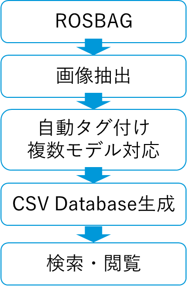
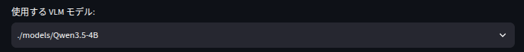
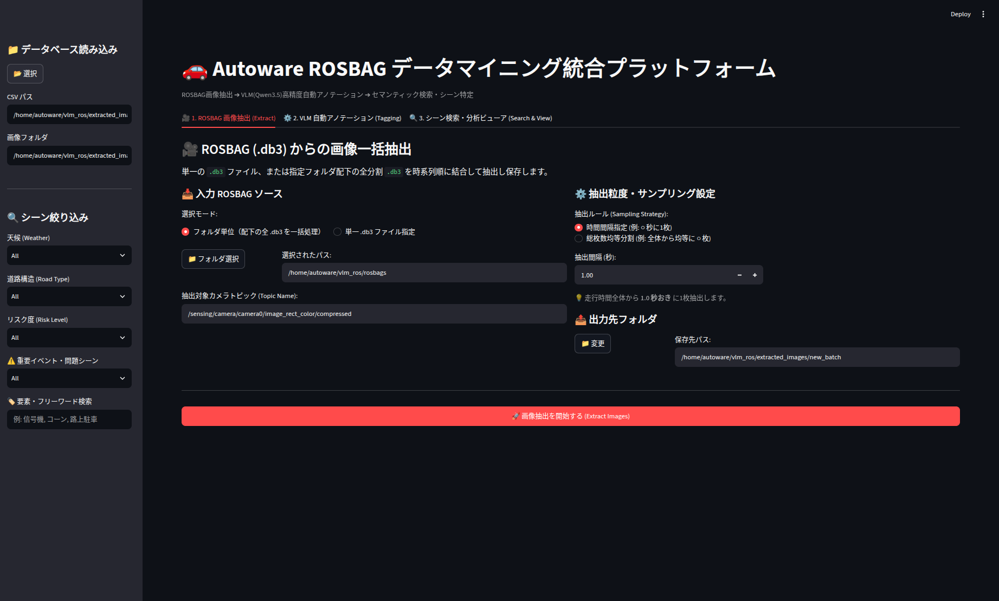
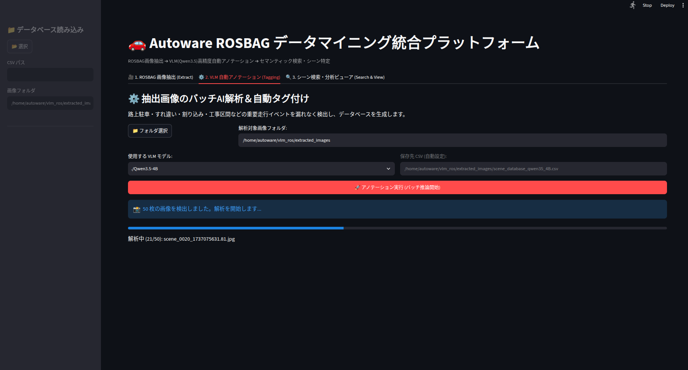
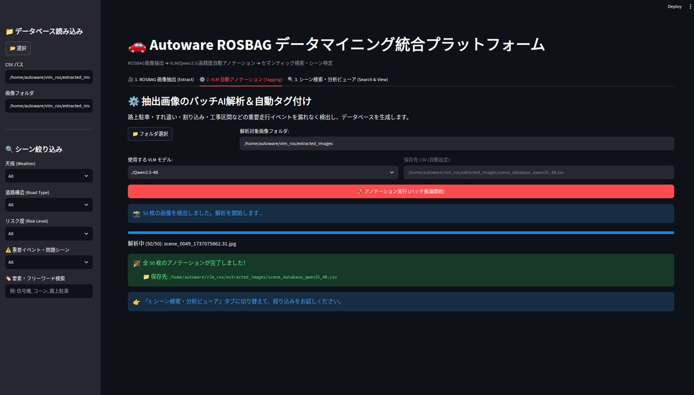
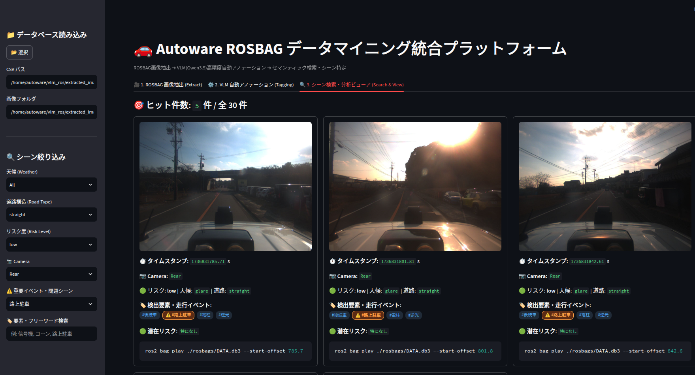

# VLM ROSBAG Analyze

ROSBAG画像抽出・VLM自動アノテーション・検索システム

## 目次

- 概要
- 動作環境
- プロジェクト構成
- セットアップ
- モデル配置
- ROSBAG配置
- 初回起動確認
- 起動方法
- 主な機能
  - ROSBAG Extract
  - VLM Tagging
  - Search & View
- リリース
- 今後の予定
- クイックスタート

---

## 概要

本システムは以下の機能を統合したツールです。

- ROSBAGからの画像抽出
- VLM（Qwen3.5シリーズ）による自動アノテーション
- CSVデータベース生成
- シーン検索・閲覧
- マルチカメラ対応（Front / Rear / FrontLeft / RearLeft / FrontRight / RearRight）



---

## 動作環境

- Ubuntu: 22.04
- Python: 3.10
- NVIDIA RTX対応GPU推奨 VRAM 10GB以上必須
- CUDA環境 Version: 12
- Transformers Version: 5.16.1

動作確認環境

- GPU : RTX2080Ti
- VRAM : 約9～10GB
- Model : Qwen3.5-4B

---

## プロジェクト構成

```text
vlm_ros/

├── app.py
├── install.sh
├── run.sh
├── requirements.txt

├── models/
├── rosbags/
├── extracted_images/
```

---

## セットアップ

リポジトリを取得します。

```bash
git clone https://github.com/Abalizzw/vlm_rosbag_analyze.git

cd vlm_ros_analyze
```

インストールを実行します。

```bash
chmod +x install.sh

./install.sh
```

---

## モデル配置
---

## VLMのダウンロード(Qwen3.5)

推奨モデル：

- [Qwen3.5-4B](https://huggingface.co/Qwen/Qwen3.5-4B) （推奨・安定版）
- [Qwen3.5-0.8B](https://huggingface.co/Qwen/Qwen3.5-0.8B) （軽量版）

### HuggingFace CLIを使用する場合

HuggingFace CLIをインストールしてください。

```bash
pip install -U "huggingface_hub[cli]"
```
必要に応じてログイン

```bash
hf auth login
```
### Qwen3.5-4B

```bash
hf download Qwen/Qwen3.5-4B \
    --local-dir ./models/Qwen3.5-4B
```

### Qwen3.5-0.8B

```bash
hf download Qwen/Qwen3.5-0.8B \
    --local-dir ./models/Qwen3.5-0.8B
```

ダウンロード後のフォルダ構成例：

```text
models/

├── Qwen3.5-4B
└── Qwen3.5-0.8B
```

### ローカルモデル確認

アプリ起動後、TAG2「VLM Tagging」のモデル選択欄に表示されれば設定完了です。


---

## ROSBAG配置

以下のフォルダへROSBAGデータを配置してください。

```text
rosbags/
```

単一の `.db3` ファイルまたは複数分割された `.db3` ファイルに対応しています。

---
## 初回起動確認
```bash
source vlm_env/bin/activate
python
```
次に
```python
import torch
print(torch.cuda.is_available())
```
以下の内容がターミナルで出力されたら環境配置が正常である。
```bash
True
```

## 起動方法

```bash
chmod +x run.sh

./run.sh
```

または

```bash
source vlm_env/bin/activate

streamlit run app.py
```

ブラウザで以下へアクセスしてください。

```text
http://localhost:8501
```

---

## 主な機能

### ROSBAG Extract

- ROSBAG画像抽出
- 単一db3ファイル対応
- フォルダ一括処理対応
- 時間間隔指定抽出
- 総抽出枚数指定
- マルチカメラ対応

対応カメラ

```text
Front
Rear
FrontLeft
RearLeft
FrontRight
RearRight
```


---

### VLM Tagging

- 自動タグ生成
- 自動運転シーン解析
- JSON出力
- CSVデータベース生成
- モデル選択機能



---

### Search & View

- タグ検索
- リスク検索
- カメラ別検索
- イベント検索
- CSV閲覧

重要イベント

```text
路上駐車
対向車すれ違い
追い越し
割り込み
工事区間
狭路走行
急ブレーキ
飛び出し注意
```


---

## リリース

### Ver1.0

- 基本版リリース
- VLM自動アノテーション
- CSV生成
- 検索機能

### Ver2.0

- ROSBAG画像抽出機能追加
- Sampling Strategy追加
- モデル選択機能追加
- 重要イベントハイライト追加

### Ver3.0

- マルチカメラ対応
- Cameraタグ追加
- Camera情報CSV保存
- Camera-Aware Prompt導入
- カメラ別検索対応

---

## 今後の予定

- 他VLMモデル対応
- マルチモデル比較
- マルチモデル投票機能
- アノテーション精度向上
- シーン検索機能強化

# クイックスタート

### 1. リポジトリ取得

```bash
git clone https://github.com/Abalizzw/vlm_rosbag_analyze.git

cd vlm_ros_analyze
```

### 2. 環境構築

```bash
chmod +x install.sh

./install.sh
```

### 3. Qwenモデル配置

推奨モデルを `models/` フォルダへ配置してください。

```text
models/

├── Qwen3.5-4B
└── Qwen3.5-0.8B
```

### 4. ROSBAG配置

解析対象のROSBAGを `rosbags/` フォルダへ配置してください。

```text
rosbags/
```

### 5. アプリ起動

```bash
chmod +x run.sh

./run.sh
```

ブラウザで以下へアクセスしてください。

```text
http://localhost:8501
```
